# Simple Scheduling

<html>

<head>
    <meta http-equiv=Content-Type content="text/html; charset=utf-8">
    <meta name=Generator content="Microsoft Word 15 (filtered)">
    
</head>

    

        

            &nbsp;
        

        <h2>
            <a name="_Toc119977360">
                <b>
                    Scheduling
                </b>
            </a>
        </h2>

        

            &nbsp;
        

        

            보통 일반적인 가정에서 사용하는 컴퓨터는 적게는 
            2
            코어
            ,
            
            많게는 
            8
            코어로 구성되어 있는 
            CPU
            를 탑재하고 있다
            . 
            하지만 컴퓨터는 
            8
            개보다 훨씬 많은 수백 개의 프로세스를 실행할 수 있다
            . 
            이는 운영체제의 
            CPU 
            스케줄러가 프로세스를 얼마동안 실행할지
            , 
            어떤 순서로 프로세스를 실행할지 결정하는 스케줄링 과정을 통해 
            CPU 
            자원을 여러 프로세스에게 적절히 분배하기 때문이다
            . 
            이러한 작업은 굉장히 빨리 이루어지기 때문에
            , 
            사용자는 마치 여러 개의 프로세스가 동시에 실행되고 있는 것처럼 느끼게 된다
            .
        

        

            &nbsp;
        

        

            
                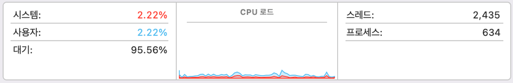
            
        

        

            ↑ 
            8
            코어 
            CPU
            에서
             600
            개가 넘는 프로세스들이 실행되고 있다
            .
        

        

            &nbsp;
        

        

            스케줄링은 프로세스가 다음과 같은 상태 변화를 가질 때 수행된다
            .
        

        

            &nbsp;
        

        

            
                1.
                &nbsp;&nbsp;&nbsp;&nbsp;
                
            
            Running 
            → 
            Waiting
        

        

            
                2.
                &nbsp;&nbsp;&nbsp;&nbsp;
                
            
            Running 
            → 
            Ready
        

        

            
                3.
                &nbsp;&nbsp;&nbsp;&nbsp;
                
            
            Waiting 
            → 
            Ready
        

        

            
                4.
                &nbsp;&nbsp;&nbsp;&nbsp;
                
            
            Running 
            → 
            Terminated
        

        

            &nbsp;
        

        

            프로세스가 
            Running 
            상태에 있을 때 
            CPU 
            자원을 사용할 수 있는데
            , 
            이때 만약 프로세스가 
            I/O, 
            네트워크
            등과 상호작용하는 작업을 수행해야 될 경우 
            Waiting
            
            상태로 전환되면서 
            CPU 
            스케줄링에서 제외된다
            . 
            프로세스가 
            Waiting
            
            상태에서 작업을 모두 마치거나 주어진
            
            CPU 
            사용 시간을 모두 소모하면 
            Ready queue
            로 스케줄링 되어 
            Ready 
            상태가 된다
            . Ready queue
            에 있는 프로세스는 
            CPU 
            스케줄러가 우선순위 등을 고려하여 순서를 결정 후
            , 
            차례가 되면 
            CPU 
            자원을 사용하게 된다
            . 
        

        

            &nbsp;
        

        

            
                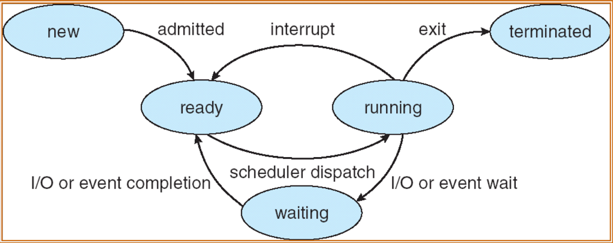
            
        

        

            ↑ 프로세스의 생명 주기
        

        

            &nbsp;
        

        

            스케줄링에는 비 선점형과 선점형의 두가지 기법이 있다
            . 
            비 선점형은 현재 
            Running
            
            상태에 프로세스가 존재할 경우
            , 
            이 프로세스가 주어진 
            CPU 
            시간을 모두 소모할 때까지 다른 프로세스가 
            Ready queue
            에 도착해도 
            CPU
            를 할당 할 수 없다
            . 
            선점형은 이와 반대로
            ,
            Running 
            상태의 프로세스가 
            CPU 
            시간이 남았더라도
            , 
            우선순위가 더 높은 프로세스가 
            Ready queue
            에
            도착하면
             Context
            switching
            이 가능한 기법이다
            .
        

        

            &nbsp;
        

        <h2>
            <a name="_Toc119977361">
                <b>
                    Scheduler
                </b>
            </a>
        </h2>

        

            &nbsp;
        

        

            스케줄러는 어떤 프로세스에게 
            CPU 
            자원을
            얼마동안 할당할 것인지 결정하는 알고리즘으로
            ,
            
            다음과 같은 기준으로 평가할 수 있다
            .
        

        

            &nbsp;
        

        

            
                1.
                &nbsp;&nbsp;&nbsp;&nbsp;
                
            
            대기 시간 
            : 
            프로세스가 
            Ready queue
            에서 대기하는 시간
        

        

            
                2.
                &nbsp;&nbsp;&nbsp;&nbsp;
                
            
            실행 시간 
            : 
            프로세스가 실행중인 시간
        

        

            
                3.
                &nbsp;&nbsp;&nbsp;&nbsp;
                
            
            응답 시간 
            : 
            요청에 대한 프로세스의 응답이 오기까지 걸리는 시간
        

        

            
                4.
                &nbsp;&nbsp;&nbsp;&nbsp;
                
            
            반환 시간 
            : 
            프로세스가 
            Ready queue
            에 도착했을 때와 종료될 때까지의 시간
        

        

            
                5.
                &nbsp;&nbsp;&nbsp;&nbsp;
                
            
            처리량 
            : 
            단위 시간 당 
            CPU
            가 처리한 프로세스의 개수
        

        

            &nbsp;
        

        

            과거에는 스케줄러의
            응답 시간이 매우 길어서 키보드로 문자를 입력하면 모니터에 그 문자가 표시될 때까지 오래 걸리는 경우가 있었다
            . 
            이는 특정 프로세스에 대한 키보드 입력
            (
            요청
            )
            을 
            CPU
            가 처리하여 모니터로 표시
            (
            응답
            )
            하기 까지 걸리는 시간
            , 
            즉
            응답 시간이 매우 길다는 것을 의미한다
            .
            
            따라서 응답 시간은 사용자가 직접 체감할
            수 있는 영역이므로 짧을 수록 좋지만
            ,
            
            단순히 최소화만 한다면 
            Context switching
            이 그만큼 자주 일어나게 되므로 처리량이 그에 비해 높아지지
            않을 수 있다
            . 
            이러한 요소들에 의해 스케줄러는 응답 시간을 최소화하면서 최대의
            처리량을 꾀하는 방향으로 발전하게 됐다
            .
        

        

            스케줄링 알고리즘에 대한 연구가 많이 이루어지면서 현대에는 다양한 스케줄러들이 존재하는데
            , 
            이번 과제에선 
            FIFO, RR, MLQ, MLFQ, CFS
            로 총 
            5
            가지의 스케줄러를 구현하였다
            .
        

        

            &nbsp;
        

        <h3 style='margin-left:50.0pt;text-indent:-20.0pt'>
            <a name="_Toc119977362">
                <b>
                    FIFO(First In First Out)
                </b>
            </a>
        </h3>

        

            &nbsp;
        

        

            
                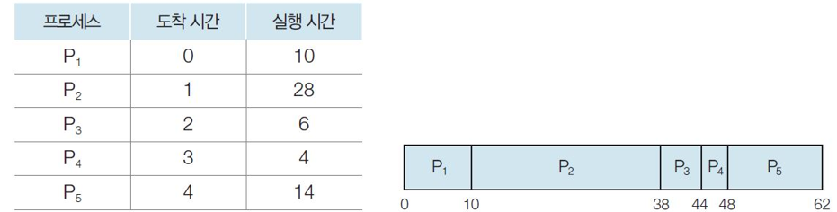
            
        

        

            ↑
             FIFO 
            스케줄러의 동작 방식
            <a href="#_edn1" name="_ednref1" title="">
                
                    
                        
                            [i]
                        
                    
                
            </a>
            (tistory, 2019)
        

        

            &nbsp;
        

        

            프로세스가
            
            Ready queue
            에
            
            도착한
            
            순서대로
            
            실행시키는
            
            스케줄러이다
            . 
            일단
            
            프로세스가
            
            Running 
            상태에
            
            들어가게
            
            되면
             CPU 
            작업을
            
            모두
            
            마칠
            
            때까지
            
            CPU
            를
            
            점유하게
            
            된다
            . FIFO
            
            스케줄러는
            
            구현이
            
            간단하고
            , 
            만약
            
            CPU 
            작업이
            
            짧은
            
            순서대로
            
            프로세스가
            
            도착하게
            
            된다면
            
            처리량이
            
            높다는
            
            장점이
            
            있다
            . 
            하지만
            , 
            실제로는
            
            프로세스들이
            
            무작위로
            
            Ready queue
            에
            
            도착하게
            
            되고
            , 
            만약
            
            CPU 
            작업이
            
            긴
            
            프로세스가
            
            먼저
            
            도착하게
            
            된다면
            
            그
            
            뒤로
            
            도착한
            
            프로세스들의
            
            대기
            
            시간은
            
            매우
            
            길어지게
            
            되는
            
            Convoy effect
            가
            
            존재한다
            .
        

        

            Ready queue
            에서
            
            CPU 
            작업이
            
            짧은
            
            프로세스를
            
            먼저
            
            처리하는
            
            비
            
            선점형의
            
            SJF(Shortest Job First), 
            선점형의
            
            SRTF(Shortest Remaining Time First) 
            스케줄러도
            
            존재하지만
            , 
            실제로
            
            프로세스의
            
            CPU 
            작업이
            
            얼마나
            
            소요될지
            
            알아내는
            
            것은
            
            어렵기
            
            때문에
            
            이러한
            
            스케줄러들은
            
            구현하기
            
            어렵다는
            
            단점이
            
            있다
            .
        

        

            &nbsp;
        

        <h3 style='margin-left:50.0pt;text-indent:-20.0pt'>
            <a name="_Toc119977363">
                <b>
                    RR(Round Robin)
                </b>
            </a>
        </h3>

        

            &nbsp;
        

        

            
                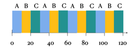
            
        

        

            ↑ 
            RR 
            스케줄러의 동작 방식
            <a href="#_edn2" name="_ednref2" title="">
                
                    
                        
                            [ii]
                        
                    
                
            </a>
            (velog, 2021)
        

        

            &nbsp;
        

        

            Ready queue
            에
            
            있는
            
            모든
            
            프로세스들에게
            
            똑같은
            
            Time slice
            를
            
            할당하는
            
            스케줄러이다
            . Time
            slice
            에
            
            따라
            
            특징이
            
            달라지는데
            , 
            길게
            
            설정한다면
            
            FIFO
            와
            
            비슷한
            
            장단점을
            
            보이지만
            , 
            짧게
            
            설정한다면
            
            응답
            
            시간이
            
            줄어들고
            
            fairness
            가
            
            좋아지는
            
            장점을
            
            가진다
            . 
            하지만
            
            Context switching
            이
            
            자주
            
            일어나게
            
            되므로
            
            처리량이
            
            낮아지고
            
            각
            
            프로세스의
            
            대기
            
            시간이
            
            길어지게
            
            되는
            
            단점도
            
            갖게
            
            된다
            . 
            이러한
            
            특징으로
            
            인해
            
            실제로는
            
            짧은
            
            CPU 
            작업을
            
            가지는
            
            프로세스와
            
            긴
            
            CPU 
            작업을
            
            가지는
            
            프로세스
            
            사이에서
            
            균형을
            
            이루는
            
            Time slice
            를
            
            설정하게
            
            된다
            . 
            현대
            
            운영체제의
            
            Time slice
            는
            
            10ms ~ 100ms 
            사이의
            
            값을
            
            가지고
            
            있다
            .
        

        

            &nbsp;
        

        <h3 style='margin-left:50.0pt;text-indent:-20.0pt'>
            <a name="_Toc119977364">
                <b>
                    MLQ(Multi-Level Queue)
                </b>
            </a>
        </h3>

        

            &nbsp;
        

        

            
                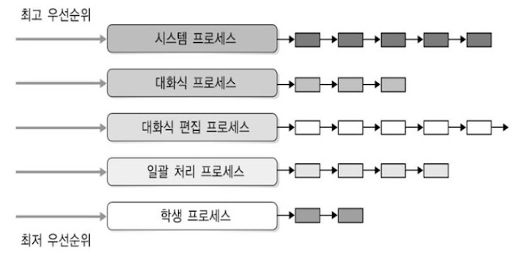
            
        

        

            ↑ 
            MLQ 
            스케줄러의 구조 예시
            <a href="#_edn3" name="_ednref3" title="">
                
                    
                        
                            [iii]
                        
                    
                
            </a>
            (blogspot, 2019)
        

        

            &nbsp;
        

        

            여러
            
            개의
            
            독자적인
            
            스케줄러를
            
            가지는
            
            Ready queue
            로
            
            이루어진
            
            스케줄러이다
            . 
            각
            
            queue
            는
            
            서로
            
            다른
            
            우선순위를
            
            갖고
            
            있으며
            , 
            각자
            
            다른
            
            스케줄러
            
            및
            
            Time slice
            를
            
            갖고
            
            있다
            . 
            예를
            
            들면
            , 
            위
            
            예시에서
            
            시스템
            
            프로세스
             queue
            는
            
            RR 
            스케줄러로
            
            동작하고
            
            학생
            
            프로세스
            
            queue
            는
            
            FIFO 
            스케줄러로
            
            동작하는
            
            방식이다
            . 
            하위
            
            우선순위를
            
            가진
             queue
            에
            
            있는
            
            프로세스는
            
            상위
            
            우선순위를
            
            가진
            
            queue
            들이
            
            모두
            
            비어
            
            있어야
            
            Running 
            상태로
            
            전환된다
            . 
            또한
            ,
            Running 
            상태에
            
            있던
            
            중에
            
            상위
            
            우선순위
            
            queue
            에
            
            프로세스가
            
            들어온다면
            
            CPU
            를
            
            반납해야
            
            한다
            . MLQ 
            스케줄러에서
            
            프로세스는
            
            queue
            간
            
            이동을
            
            하지
            
            못하므로
            , 
            우선순위가
            
            낮은
            
            queue
            에
            
            있는
            
            프로세스는
            
            CPU 
            자원을
            
            받지
            
            못하는
            
            Starvation 
            현상이
            
            발생
            
            수
            
            있다는
            
            단점이
            
            존재한다
            .
        

        

            &nbsp;
        

        <h3 style='margin-left:50.0pt;text-indent:-20.0pt'>
            <a name="_Toc119977365">
                <b>
                    MLFQ(Multi-Level Feedback Queue)
                </b>
            </a>
        </h3>

        

            &nbsp;
        

        

            
                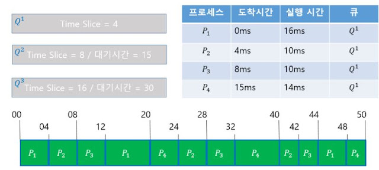
            
        

        

            ↑ 
            MLFQ 
            스케줄러의 동작 방식
            <a href="#_edn4" name="_ednref4" title="">
                
                    
                        
                            [iv]
                        
                    
                
            </a>
            (blogspot,
            2019)
        

        

            &nbsp;
        

        

            MLFQ 
            스케줄러는
            
            MLQ
            와
            
            다르게
            
            Feedback
            을
            
            통해
            
            프로세스의
            
            queue
            간
            
            이동을
            
            허용한다
            . MLFQ
            의
            
            규칙은
            
            다음과
            
            같다
            .
        

        

            &nbsp;
        

        

            
                1.
                &nbsp;&nbsp;&nbsp;&nbsp;
                
            
            Priority(A) &gt; Priority(B) 
            이면
            , A
            가
            
            실행된다
            .
        

        

            
                2.
                &nbsp;&nbsp;&nbsp;&nbsp;
                
            
            Priority(A) = Priority(B) 
            이면
            , A
            와
             B
            는
             RR 
            방식으로
            
            실행된다
            .
        

        

            
                3.
                &nbsp;&nbsp;&nbsp;&nbsp;
                
            
            프로세스가
            
            생성되면
            , 
            가장
            
            높은
            
            우선순위의
            
            queue
            에
            
            놓여진다
            .
        

        

            
                4.
                &nbsp;&nbsp;&nbsp;&nbsp;
                
            
            주어진
            
            단계에서
            
            시간
            
            할당량을
            
            소진하면
             (CPU
            를
            
            몇
            
            번
            
            양도하였는지
            
            상관없이
            ), 
            우선순위가
            
            한
            
            단계
            
            낮은
            
            queue
            로
            
            이동한다
            .
        

        

            
                5.
                &nbsp;&nbsp;&nbsp;&nbsp;
                
            
            일정
            
            시간이
            
            지나면
            , 
            모든
            
            프로세스는
            
            가장
            
            높은
            
            우선순위의
            
            queue
            로
            
            이동한다
            .
        

        

            &nbsp;
        

        

            보통
            
            우선순위가
            
            낮을수록
             Time slice
            가
            
            길어지도록
            
            설정되어
            
            있으므로
            , 
            위
            
            규칙에
            
            따르면
            
            CPU 
            중심의
            
            프로세스들은
            
            우선순위가
            
            빠르게
            
            내려가기
            
            때문에
            
            CPU
            를
            
            더
            
            오랜
            
            시간동안
            
            점유할
            
            수
            
            있게
            
            되고
            , I/O 
            중심의
            
            프로세스들은
            
            우선순위가
            
            느리게
            
            내려가므로
            
            CPU 
            중심의
            
            프로세스들보다
            
            더
            
            빠르게
            
            교체될
            
            수
            
            있어
            
            더
            
            나은
            
            응답
            
            시간을
            
            기대할
            
            수
            
            있다
            . 
            또한
            , 
            일정
            
            시간마다
            
            모든
            
            프로세스를
            
            최상위
            
            우선순위의
            
            queue
            로
            
            이동시킴으로써
            
            MLQ
            에서
            
            발생하던
            
            Starvation
            을
            
            방지할
            
            수
            
            있게
            
            된다
            .
        

        

            &nbsp;
        

        <h3 style='margin-left:50.0pt;text-indent:-20.0pt'>
            <a name="_Toc119977366">
                <b>
                    CFS(Completely Fair Scheduler)
                </b>
            </a>
        </h3>

        

            &nbsp;
        

        

            
                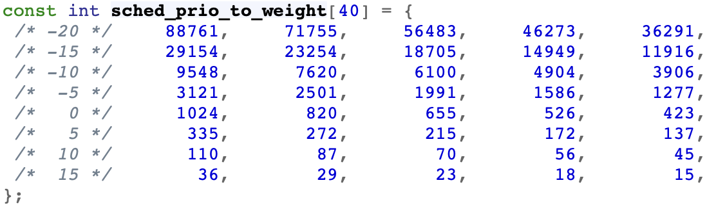
            
        

        

            ↑ 
            CFS 
            스케줄러의 우선순위에 따른 가중치 테이블
            <a href="#_edn5" name="_ednref5" title="">
                
                    
                        
                            [v]
                        
                    
                
            </a>
            (bootlin, n.d.)
        

        

            &nbsp;
        

        

            CFS 
            스케줄러는
            
            리눅스
             2.6.23 
            커널
            
            버전
            
            이후
            
            적용된
            
            리눅스의
            
            기본
            
            스케줄러이다
            . CFS
            는
            
            100
            부터
            
            139
            까지의
            
            우선순위로
            
            일반
            
            프로세스를
            
            분류하고
            , 
            우선순위가
            
            클수록
            
            낮은
            
            가중치를
            
            부여한다
            . 
            그리고
            
            프로세스마다
            
            CPU
            를
            
            점유하고
            
            있던
            
            시간
            , 
            즉
            
            vruntime
            을
            
            누적
            , 
            가중치를
            
            사용해
            
            정규화
            
            하여
            
            기록해
            
            놓는다
            .
        

        

            &nbsp;
        

        

            
                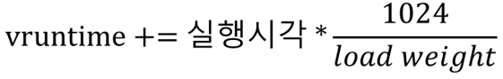
            
        

        

            ↑
             vruntime 
            계산 공식
            <a href="#_edn6" name="_ednref6" title="">
                
                    
                        
                            [vi]
                        
                    
                
            </a>
            (egloos,
            2019)
        

        

            &nbsp;
        

        

            vruntime
            은
            
            가중치에
            
            의해
            
            우선순위가
            
            높은
            (
            값이
            
            작은
            ) 
            프로세스는
            
            천천히
            
            커지고
            , 
            낮은
            (
            값이
            
            큰
            ) 
            프로세스는
            
            빠르게
            
            커진다
            . 
            이
            
            vruntime
            들은
            
            프로세스
            ID
            와
            
            함께
            
            Ready queue
            에
            
            저장된다
            . CFS
            의
            
            Ready queue
            는
            
            다른
            
            스케줄러들과
            
            다르게
            
            Red-Black Tree
            로
            
            이루어져
            
            있다
            . Red-Black Tree
            는
            
            Key
            값이
            
            작은
            
            Value
            부터
            
            제일
            
            왼쪽
            
            노드에
            
            위치하도록
            
            정렬된
            
            자료
            
            구조인데
            , CFS
            에선
            
            vruntime
            이
            
            Key, 
            프로세스
            ID
            가
            
            Value
            로
            
            할당되어
            
            노드를
            
            형성하고
            
            있다
            . CFS 
            스케줄러는
            
            스케줄링이
            
            일어날
            
            때
            
            이
            
            Ready Queue
            에서
            
            가장
            
            왼쪽
            
            노드
            , 
            즉
            
            vruntime
            이
            
            가장
            
            작은
            
            프로세스에게
            
            CPU 
            자원을
            
            할당하게
            
            된다
            .
        

        

            &nbsp;
        

        

            
                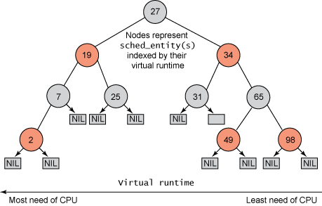
            
        

        

            ↑ 
            CFS 
            스케줄러의 
            
                Red-Black Tree
                <a href="#_edn7" name="_ednref7" title="">
                    
                        
                            [vii]
                        
                    
                </a>
            
            (uzoogom, 2010)
        

        

            &nbsp;
        

        

            하지만 
            vruntime
            은 다음에 어떤 프로세스를 실행할지 조정하는 값일 뿐
            , 
            이 값 자체가 
            Time slice
            로 기능하진 않는다
            . Time slice
            는 프로세스의 우선순위에 따라 고정된 값을 사용하게 된다
            .
        

        

            
                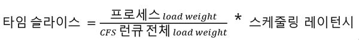
            
        

        

            ↑ 
            Time slice 
            계산 공식
            <a href="#_edn8" name="_ednref8" title="">
                
                    
                        
                            [viii]
                        
                    
                
            </a>
            (egloos,
            2019)
        

        

            &nbsp;
        

        
             
        

        

            &nbsp;
        

        <h1>
            <a name="_Toc119977367">
                <b>
                    Implementation
                </b>
            </a>
        </h1>

        

            &nbsp;
        

        <h2>
            <a name="_Toc119977368">
                <b>
                    구현
                </b>
            </a>
            <b>
                
            </b>
            <b>
                환경
            </b>
            <b>
                
            </b>
            <b>
                및
            </b>
            <b>
                
            </b>
            <b>
                실행
            </b>
            <b>
                
            </b>
            <b>
                방법
            </b>
        </h2>

        

            &nbsp;
        

        

            운영체제
             : macOS
        

        

            언어
            
            : C++14
        

        

            컴파일러
            
            : clang 14.0.0
        

        

            Makefile 
            사용하여
            
            컴파일
            
            가능
            
            (macOS, Linux)
        

        

            소스
            
            파일
            
            : Makefile, main.h, main.cpp, Scheduler.h,
            Scheduler.cpp, Process.h, Process.cpp, FIFO.h, FIFO.cpp RR.h, RR.cpp, MLQ.h,
            MLQ.cpp, MLFQ.h, MLFQ.cpp, CFS.h, CFS.cpp
        

        

            실행
            
            방법
            
            : ./2022_os_proj1
            로
            
            실행
            
            후
            
            사용자의
            
            입력에
            
            따른
            
            스케줄러로
            
            실행
        

        

            실행
            
            완료
            
            후
            
            출력
            
            파일
             : &lt;
            스케줄러
            
            이름
            &gt;_schedule_dump.txt
        

        

            실행
            
            시간
            
            : 
            약
            
            500
            초
        

        

            &nbsp;
        

        <h2>
            <a name="_Toc119977369">
                <b>
                    프로그램
                </b>
            </a>
            <b>
                
            </b>
            <b>
                구조
            </b>
        </h2>

        

            &nbsp;
        

        

            
                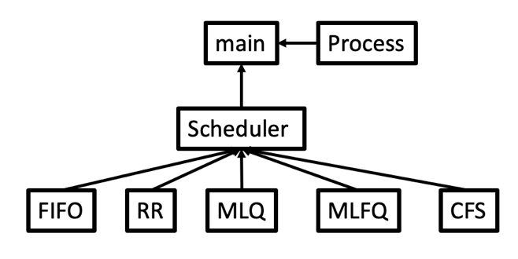
            
        

        

            ↑ 프로그램의 소스 파일 구조
        

        

            &nbsp;
        

        

            본
            
            프로그램은
            
            main, Process, Scheduler, FIFO, RR, MLQ, MLFQ, CFS
            로
            
            이루어져
            
            있다
            . main
            은
            
            10
            개의
            child 
            프로세스를
            
            만들고
            
            각각
            
            0 ~ 19 
            사이의
            
            난수를
            
            priority 
            값으로
            
            할당한다
            . 
            그리고
            
            50ms
            마다
            
            SIGALRM 
            신호를
            
            생성
            , signal_handler
            를
            
            통해
            
            SIGUSR1
            을
            
            현재
            
            Running 
            상태에
            
            있는
            
            child 
            프로세스에게
            
            전송한다
            . Process
            는
            
            child 
            프로세스에서
            
            실행되는
            
            코드로
            , 
            최초
            
            실행
            
            시
            
            CPU_burst
            와
            
            IO_burst
            를
            
            10 ~ 200 
            사이의
            
            난수로
            
            할당
            
            받는다
            . 
            또한
            , SIGUSR1
            을
            
            받을
            
            때마다
            
            CPU_burst
            를
            
            1
            씩
            
            감소시키고
            , 
            만약
            
            0
            이
            
            되면
            
            main
            에게
            
            Message
            Queue
            를
            
            통해
            
            I/O
            를
            
            요청한
            
            후
            
            CPU_burst
            와
            
            IO_burst
            를
            
            난수로
            
            다시
            
            할당
            
            받는다
            .
            Scheduler
            는
            
            사용자가
            
            선택한
            
            스케줄러에
            
            따른
            
            데이터에
            
            접근하는
            
            기능을
            
            하며
            , FIFO, RR, MLQ, MLFQ, CFS
            는
            
            해당
            
            스케줄러에
            
            필요한
            
            자료구조와
            
            함수가
            
            선언되어
            
            있다
            .
        

        
             
        

        

            &nbsp;
        

        <h2>
            <a name="_Toc119977370">
                <b>
                    IPC(Inter-Process
                    Communication)
                </b>
            </a>
        </h2>

        

            &nbsp;
        

        <h3 style='margin-left:50.0pt;text-indent:-20.0pt'>
            <a name="_Toc119977371">
                <b>
                    Signal
                </b>
            </a>
        </h3>

        

            &nbsp;
        

        

            
                
            
        

        

            ↑ 
            main.cpp
            의 
            sigaction()
        

        

            &nbsp;
        

        

            
                
            
        

        

            ↑
             main.cpp
            의 
            setitimer()
        

        

            &nbsp;
        

        

            main
            은
            
            sigaction()
            을 통해 
            SIGALRM
            에 대한 
            signal_handler
            를 설정하고
            , setitimer()
            로 
            50ms
            마다 
            SIGALRM
            을 수신하게 된다
            .
        

        

            &nbsp;
        

        

            
                
            
        

        

            ↑
             main.cpp
            의 
            signal_handler() 
            일부
        

        

            &nbsp;
        

        

            SIGALRM
            을
            수신하면 현재 
            Running 
            상태에 있는 
            child
            에게 
            SIGUSR1
            을 보내 
            CPU_burst
            를 
            1 
            감소시킨다
            .
            
            만약 
            Wait queue
            에도 프로세스가 있는 경우
            , Wait queue
            에 속한 모든 프로세스의 
            IO_burst
            를 
            1
            씩 감소시킨다
            .
        

        

            &nbsp;
        

        

            
                
            
        

        

            ↑ 
            Process.cpp
            의 
            signal_handler() 
            일부
        

        

            &nbsp;
        

        

            SIGUSR1
            을
            수신한 
            child
            는 자신의 
            CPU_burst
            를 
            1 
            감소시킨 후
            ,
            
            만약 
            CPU_burst
            가 
            0
            이라면 
            I/O
            
            작업을 위해 
            main
            에 
            Message Queue
            로 
            I/O 
            요청을 보낸다
            .
        

        

            &nbsp;
        

        <h3 style='margin-left:50.0pt;text-indent:-20.0pt'>
            <a name="_Toc119977372">
                <b>
                    Message Queue
                </b>
            </a>
        </h3>

        

            &nbsp;
        

        

            
                
            
        

        

            ↑ 
            Message Queue
            로 
            main 
            프로세스에 전송할 데이터
        

        

            &nbsp;
        

        

            
                
            
        

        

            ↑
            Process.cpp
            의 
            sendMsg()
        

        

            &nbsp;
        

        

            child 
            프로세스는
            
            SIGUSR1
            을 수신할 때마다 
            msgsnd()
            를 통해 
            CPU_burst
            와 
            IO_burst 
            시간과 
            isIOJob 
            값을 보내게 된다
            . 
            만약 
            CPU_burst
            가 
            0
            이라면 
            isIOJob
            으로 
            true
            를
            , 
            아니면 
            false
            를 할당한다
            .
        

        

            &nbsp;
        

        

            
                
            
        

        

            ↑ 
            main.cpp
            의 무한 루프문
        

        

            &nbsp;
        

        

            main
            은
            
            signal_handler()
            를
            
            수행중인
            
            경우를
            
            제외하곤
            
            child
            로부터
            
            Message Queue
            로
            
            msgblock
            이
            
            도착했는지
            
            무한
            
            루프
            
            속에서
            
            계속
            
            확인한다
            . 
            도착한
            
            경우
            , msgblock
            의
            
            isIOJob
            이
            
            true
            면
            
            현재
            
            Running 
            중인
            
            child
            를
            
            Wait queue
            로
            
            보내고
            , 
            아니면
            
            남은
            
            Time slice
            를
            
            확인
            
            후
            
            현재
            
            child
            를
            
            Inactive
            queue
            로
            
            보내거나
            
            계속
            
            진행한다
            .
        

        

            &nbsp;
        

        <h2>
            <a name="_Toc119977373">
                <b>
                    FIFO
                </b>
            </a>
        </h2>

        

            &nbsp;
        

        

            
                
            
        

        

            ↑ 
            FIFO.h
        

        

            &nbsp;
        

        

             FIFO 
            클래스의
            
            Ready queue
            와
            
            Wait queue
            는
            
            각각
            
            std::queue
            와
            
            std::vector
            로
            
            구현되어
            
            있다
            . now_pid
            는
            
            readyQ
            의
            
            첫번째
            
            pid
            로
            , 
            현재
            
            Running 
            상태에
            
            있는
            
            child
            의
            
            프로세스
            ID
            를
            
            의미한다
            .
            child 
            프로세스들은
            
            최초에
            
            모두
            
            readyQ
            로
            
            push()
            되고
            , 
            한번
            
            Running 
            상태에
            
            들어가면
            
            CPU_burst
            를
            
            전부
            
            소진할
            
            때까지
            
            now_pid
            가
            
            변경되지
            
            않는다
            . CPU_burst
            를
            
            모두
            
            소진하면
            
            waitQ
            로
            
            push()
            되어
            
            IO_burst
            를
            
            전부
            
            소진할
            
            때까지
            
            readyQ
            에
            
            push()
            되지
            
            않는다
            .
        

        

            &nbsp;
        

        <h2>
            <a name="_Toc119977374">
                <b>
                    RR
                </b>
            </a>
        </h2>

        

            &nbsp;
        

        

            
                
            
        

        

            ↑ 
            RR.h
        

        

            &nbsp;
        

        

            RR 
            클래스는
            
            FIFO 
            클래스에서
            
            std::queue
            의
            
            inactiveQ
            가
            
            추가된
            
            형태이다
            .
            Time slice
            를
            
            소진한
            
            프로세스
            ID
            가
            
            다시
            
            readyQ
            로
            
            push()
            되던
            
            FIFO
            와
            
            달리
            , RR
            은
            
            inactiveQ
            에
            
            push()
            된다
            . 
            만약
            
            readyQ
            가
            
            비어
            
            있고
            
            inactiveQ
            에
            
            프로세스
            ID
            가
            
            존재한다면
            , swap()
            을
            
            통해
            
            서로
            
            내용을
            
            교환하게
            
            된다
            . RR
            의
            
            Time slice
            는
            
            50 tick
            으로
            
            설정하였다
            .
        

        
             
        

        

            &nbsp;
        

        <h2>
            <a name="_Toc119977375">
                <b>
                    MLQ
                </b>
            </a>
        </h2>

        

            &nbsp;
        

        

            
                
            
        

        

            ↑ 
            MLQ.h
        

        

            &nbsp;
        

        

            본
            
            과제는
            
            고정된
            
            개수인
            
            10
            개의
            
            child 
            프로세스를
            
            스케줄링
            
            하는
            
            것이므로
            
            MLQ 
            스케줄러의
            
            우선순위
            
            레벨은
            
            3
            단계로
            
            가정하였다
            . 
            이를
            
            표현하기
            
            위해
            
            각각
            
            3
            개의
            
            Ready queue, Wait queue
            와
             now_pid
            의
            
            우선순위를
            
            나타내는
            
            now_level
            을
            
            갖고있다
            . 
            가장
            
            높은
            
            우선순위인
            
            readyFirstQ
            의
            
            Time slice
            는
            
            50 tick, 
            두번째
            
            우선순위인
            
            readySecondQ
            의
            
            Time slice
            는
            
            75 tick, 
            마지막
            
            우선순위인
            
            readyThirdQ
            의
             Time slice
            는
            
            100 tick
            이다
            .
        

        

            &nbsp;
        

        

            
                
            
        

        

            ↑ 
            Scheduler.cpp
            의 
            insertReadyQ
            의 일부분
        

        

            &nbsp;
        

        

            priority
            값을 
            0
            부터
            
            5
            까지
            , 6
            부터 
            12
            까지
            ,
            13
            부터
             19
            까지로 우선순위를 나눠서 각 
            readyQ
            에 
            push()
            하였다
            .
        

        

            &nbsp;
        

        

            
                
            
        

        

            ↑ 
            MLQ.cpp
            의 
            setNowPID()
        

        

            &nbsp;
        

        

            
                
            
        

        

            ↑ 
            Scheduler.cpp
            의 
            WaitQtoReadyQ()
            의 일부분
        

        

            &nbsp;
        

        

            MLQ
            는
            
            상위
            
            우선순위
            
            queue
            에
            
            프로세스가
            
            존재한다면
            
            하위
            
            우선순위의
            
            프로세스에
            
            CPU
            를
            
            할당하지
            
            않고
            , 
            만약
            
            할당되어
            
            있었다면
            
            이를
            
            선점하여
            
            가져오는
            
            스케줄러이므로
            
            상위
            
            readyQ
            에
            
            프로세스
            ID
            가
            
            비어
            
            있지
            
            않을
            
            때
            
            해당
            
            readyQ
            의
            
            front()
            를
            
            now_pid, 
            우선순위를
            
            now_level
            로
            
            설정하도록
            
            하였다
            . 
            또한
            , waitQ
            에서
            
            IO_burst
            를
            
            모두
            
            소진한
            
            child
            를
            
            확인할
            
            때
            
            하위
            
            waitQ
            부터
            
            확인하는
            
            방식으로
            
            구현하여
            , 
            만약
            
            상위
            
            waitQ
            에서
            
            발견했을
            
            경우
            
            now_pid
            를
            
            바로
            
            전환하도록
            
            코드를
            
            작성했다
            .
        

        
             
        

        

            &nbsp;
        

        <h2>
            <a name="_Toc119977376">
                <b>
                    MLFQ
                </b>
            </a>
        </h2>

        

            &nbsp;
        

        

            
                
            
        

        

            ↑ 
            MLFQ.h
        

        

            &nbsp;
        

        

            MLFQ 
            클래스는
            
            앞선
            
            MLQ
            에서
            
            프로세스
            ID
            별로
            
            남아있는
            
            Time slice
            를
            
            저장하는
            
            Hash map
            인
            
            std::unordered_map
            으로
            
            구현된
            
            childRemainTs
            와
            
            우선순위를
            
            초기화
            
            할
            
            시간을
            
            세는
            
            afterResetTime
            이
            
            추가된
            
            형태이다
            .
        

        

            &nbsp;
        

        

            
                
            
        

        

            ↑ 
            MLFQ.cpp
            의 
            resetPriority()
        

        

            &nbsp;
        

        

            child 
            프로세스들은
            
            처음
            
            만들어지면
            
            모두
            
            가장
            
            높은
            
            우선순위를
            
            가진
            
            readyFirstQ
            에
            
            push()
            되어
            
            CPU
            를
            
            기다린다
            . 
            만약
            
            프로세스가
            
            자신의
            
            차례가
            
            됐을
            
            때
            
            Time slice
            동안
            
            CPU_burst
            를
            
            모두
            
            소진하지
            
            못했다면
            , 
            한단계
            
            낮은
            
            Ready queue
            로
            
            push()
            되면서
            
            해당
            
            단계의
            
            Time slice
            를
            
            새로
            
            부여
            
            받는다
            . CPU_burst
            를
            
            모두
            
            소진했다면
            
            같은
            
            단계의
            
            Wait queue
            로
            
            push()
            되었다가
            
            IO_burst
            를
            
            전부
            
            소진한
            
            후
            
            다시
            
            같은
            
            단계의
            
            Ready queue
            로
            
            push()
            된다
            . 
            하지만
            
            Time slice
            는
            
            새로
            
            부여
            
            받는게
            
            아닌
            , childRemainTs
            에
            
            남아있던
            
            값을
            
            이어서
            
            받게
            
            된다
            . 
            또한
            , 900 tick
            마다
            
            모든
            
            child 
            프로세스들은
            
            readyFirstQ
            
            혹은
            
            waitFirstQ
            로
            
            push()
            되면서
            
            우선순위가
            
            초기화된다
            . 
            이러한
            
            과정을
            
            통해
            
            앞에서
            
            설명했던
            
            MLFQ
            의
            
            규칙
            
            5
            가지를
            
            모두
            
            만족하게
            
            된다
            .
        

        

            &nbsp;
        

        <h2>
            <a name="_Toc119977377">
                <b>
                    CFS
                </b>
            </a>
        </h2>

        

            &nbsp;
        

        

            
                
            
        

        

            ↑ 
            CFS.h
        

        

            &nbsp;
        

        

            CFS 
            클래스는
            
            우선순위에
            
            따른
            
            가중치가
            
            미리
            
            계산
            
            되어있는
            
            테이블인
            
            sched_prio_to_weight
            와
            
            child 
            프로세스의
            
            가중치를
            
            저장하는
            
            Hash map pidWeights, vruntime
            을
            
            저장하는
             Hash map
            인
            
            pidVruntime, Red-Black Tree 
            자료구조인
            
            std::multimap
            으로
            
            구성된
            
            readyQ, std::queue
            로
            
            구성된
            
            inactiveQ, std::vector
            로
            
            구성된
            
            waitQ
            를
            
            가진다
            . 
            본
            
            프로그램은
            
            고정된
            
            숫자인
            
            10
            개의
            
            child 
            프로세스만
            
            존재한다는
            
            것을
            
            가정했으므로
            
            sched_prio_to_weight
            는
            
            상황에
            
            맞게
            
            실제
            
            값을
            
            수정하여
            
            사용하였다
            .
        

        

            &nbsp;
        

        

            
                
            
        

        

            ↑ 
            Scheduler.cpp
            의 최초 
            child 
            프로세스
            ID 
            삽입 함수인 
            insertReadyQ()
            의 
            CFS 
            부분
        

        

            &nbsp;
        

        

            최초에
            
            child 
            프로세스들이
            
            생성되고
            
            프로세스
            ID
            가
            
            readyQ
            에
            
            insert()
            될
            
            때
            
            sched_prio_to_weight
            의
            
            priority 
            인덱스에
            
            해당하는
            
            값을
            
            가져와
            
            pidWeights
            에
            
            저장한다
            . pidVruntime
            은
            
            초기값이
            
            모두
            
            0
            이므로
            
            readyQ
            의
            
            vruntime 
            값으로도
            
            0
            을
            
            넣는다
            .
        

        

            &nbsp;
        

        

            
                
            
        

        

            ↑ 
            CFS.cpp
            의 
            updateVruntime()
        

        

            &nbsp;
        

        

            한
             tick
            이
            
            지날
            
            때마다
            
            현재
            
            Running 
            상태에
            
            있는
            
            프로세스
            ID
            의
            
            vruntime
            을
            
            갱신하는데
            , readyQ
            의
            
            vruntime
            에
            
            갱신된
            
            값을
            
            바로
            
            작성하게
            
            되면
            
            순서가
            
            바뀔
            
            수
            
            있기
            
            때문에
            
            따로
            
            pidVruntime
            에
            
            저장하도록
            
            하였다
            . 
            갱신된
            
            vruntime
            은
            
            waitQ
            에서
            
            readyQ
            로
            
            프로세스
            ID
            가
            
            이동할
            
            때
            , 
            혹은
            
            inactiveQ
            와
            
            readyQ
            를
            
            바꾸는
            
            swapQ()
            를
            
            호출할
            
            때
            
            readyQ
            에
            
            프로세스
            ID
            를
            
            insert()
            하면서
            
            같이
            
            작성된다
            .
        

        

            &nbsp;
        

        

            
                
            
        

        

            ↑ 
            CFS.cpp
            의 
            getTimeSlice()
        

        

            &nbsp;
        

        

            앞서
            
            설명했듯이
            
            vruntime
            은
            
            실제
            
            Time slice
            로는
            
            기능하지
            
            않는다
            . 
            따라서
            
            Context switching
            이
            
            일어날
            
            때마다
            
            Time slice
            를
            
            계산해야
            
            한다
            . 
            본
            
            프로그램에선
            
            child 
            프로세스들의
            
            우선순위가
            
            최초
             0 ~ 19 
            사이의
            
            난수로
            
            주어진
            
            이후
            
            별다른
            
            수정이
            
            가해지지
            
            않는다는
            
            상황을
            
            가정하여서
            , Time slice
            가
            
            처음
            
            계산한
            
            값에서
            
            변경되진
            
            않는다
            .
        

        

            &nbsp;
        

        
             
        

        

            &nbsp;
        

        <h1>
            <a name="_Toc119977378">
                <b>
                    Conclusion
                </b>
            </a>
        </h1>

        

            &nbsp;
        

        <h2>
            <a name="_Toc119977379">
                <b>
                    MLQ,
                    MLFQ, CFS 
                </b>
            </a>
            <b>
                결과
            </b>
            <b>
                
            </b>
            <b>
                분석
            </b>
        </h2>

        

            &nbsp;
        

        

            
                
            
        

        

            ↑ 
            MLQ CPU time
        

        

            &nbsp;
        

        

            MLQ
            의
            
            결과를
            
            보면
            
            우선순위가
            
            낮은
            
            readySecondQ, readyThirdQ
            에
            
            속해
            
            있던
            
            child
            들은
            
            CPU
            를
            
            전혀
            
            할당
            
            받지
            
            못하는
            
            Starvation 
            상태였거나
            , readyFirstQ
            에
            
            속한
            
            child
            들에
            
            비해
            
            매우
            
            적은
            
            CPU time
            을
            
            가졌던
            
            상태였던
            
            것을
            
            알
            
            수
            
            있다
            .
        

        

            &nbsp;
        

        

            
                
            
        

        

            ↑ 
            MLFQ CPU time
        

        

            &nbsp;
        

        

            이에
            
            비해
            
            MLFQ
            의
            
            경우
            
            child
            들이
            
            MLQ
            에
            
            비해
            
            매우
            
            고르게
            
            CPU time
            을
            
            가졌고
            , Starvation 
            또한
            
            보이지
            
            않는다
            . 
            이는
            
            처음
            
            child
            가
            
            생성됐을
            
            때
            
            priority
            에
            
            상관없이
            
            모두
            
            readyFirstQ
            에
            
            push()
            하고
            , 
            주기적으로
            
            모든
            
            child
            들을
            
            readyFirstQ,
            waitFirstQ
            에
            
            push()
            하여
            
            우선순위
            
            초기화
            
            과정을
            
            거치는
            
            MLFQ
            의
            
            작동방식
            
            덕분이다
            .
        

        

            &nbsp;
        

        

            
                
            
        

        

            ↑ 
            CFS CPU time
        

        

            &nbsp;
        

        

            CFS
            는
            
            priority
            가
            
            작은
            (
            우선순위가
            
            높은
            ) child
            는
            
            많은
            
            CPU time
            을
            
            할당
            
            받고
            ,
            priority
            가
            
            큰
            (
            우선순위가
            
            낮은
            ) child
            는
            
            적은
            
            CPU time
            을
            
            할당
            
            받은
            
            것을
            
            알
            
            수
            
            있다
            .
        

        

            &nbsp;
        

        <h2>
            <a name="_Toc119977380">
                <b>
                    느낀
                </b>
            </a>
            <b>
                
            </b>
            <b>
                점
            </b>
        </h2>

        

            &nbsp;
        

        

            생각치
            
            못한
            
            부분에서
            
            고민을
            
            해야
            
            되는
            
            상황이
            
            자주
            
            생겼던
            
            과제였다
            .
            IPC
            를
            
            처음
            
            사용하다
            
            보니
            
            Message Queue
            에서
            
            long mtype
            을
            
            제외한
            
            크기를
            
            매개변수로
            
            넣어야
            
            하는
            
            것을
            
            놓쳤던
            
            것과
            , itimerval
            의
             signal 
            간격에
            
            따라
            
            OS
            의
            
            Context
            switching
            에
            
            의해
            
            SIGALRM 
            하나가
            
            무시되거나
            
            Message Queue
            를
            
            처리하는
            
            도중
            
            signal_handler
            가
            
            불려지면서
            
            순서가
            
            뒤바뀌는
            
            등의
            
            상황이
            
            많이
            
            생겼었다
            . 
            또한
            , 
            디버깅
            
            외에도
            
            Time slice
            의
            
            길이와
            
            CPU_burst, IO_burst
            의
            
            난수
            
            범위
            
            설정에
            
            따라서도
            
            프로그램의
            
            Context switching 
            과정이
            
            드물게
            
            일어나거나
            
            너무
            
            자주
            
            일어나게
            
            되기
            
            때문에
            
            적절한
            
            값을
            
            찾는
            
            데에
            
            시간이
            
            오래
            
            걸렸다
            .
        

        

            스케줄러
            
            구현
            
            과정에선
            , 
            처음
            
            CFS
            를
            
            이해하는
            
            것과
            
            MLFQ
            의
            
            규칙을
            
            적용하는
            
            데에
            
            제일
            
            시간을
            
            많이
            
            투자한
            
            것
            
            같다
            . CFS
            의
            
            우선순위
            
            가중치와
            
            vruntime, 
            실제
            
            Time slice 
            사이의
            
            관계가
            
            잘
            
            이해가
            
            가지
            
            않아
            
            생각을
            
            많이
            
            해야
            
            됐다
            . MLFQ
            의
            
            경우
            , 5
            번
            
            규칙을
            
            구현할
            
            때
            
            Running 
            상태인
            
            프로세스가
            
            존재해도
            
            바로
            
            우선순위를
            
            초기화하는
            
            선점형으로
            
            구현할지
            , 
            아니면
            
            Running 
            상태인
            
            프로세스의
            
            Time slice
            가
            
            소진된
            
            이후에
            
            우선순위를
            
            초기화
            
            하는
            
            비
            
            선점형으로
            
            구현할지
            
            고민되었지만
            , 
            전자를
            
            구현하는
            
            데에는
            
            시간이
            
            오래
            
            걸릴
            
            것
            
            같아
            
            결국
            
            후자로
            
            구현하게
            
            되었다
            .
        

        

            이전
            
            과제들에
            
            비해
            
            이해해야
            
            할
            
            것도
            
            많고
            
            구현
            
            방법을
            
            생각해야
            
            할
            
            것도
            
            많아
            
            시간을
            
            오랫동안
            
            투자해야
            
            했던
            
            과제였다
            . 
            아쉬웠던
            
            점으론
            , 
            코드를
            
            다
            
            작성하고
            
            나서
            
            살펴보니
            
            너무
            
            복잡해
            
            보인다는
            
            생각이
            
            들었다
            . 
            좀
            
            더
            
            간단하게
            
            만들려
            
            해도
            , 
            스케줄러
            
            코드를
            
            작성하면서
            
            고쳤던
            
            버그가
            
            다시
            
            나타날
            
            것
            
            같은
            
            느낌이
            
            들어
            
            결국
            
            시도하지
            
            못했다
            . 
            코드를
            
            좀
            
            더
            
            알아보기
            
            쉽게
            
            작성하도록
            
            노력해야
            
            할
            
            것
            
            같다
            .
        

        
             
        

        

            &nbsp;
        

        <h1>
            <a name="_Toc119977381">
                <b>
                    출력
                </b>
            </a>
            <b>
                
            </b>
            <b>
                파일
            </b>
        </h1>

        

            &nbsp;
        

        <h2>
            <a name="_Toc119977382">
                <b>
                    FIFO
                </b>
            </a>
        </h2>

        

            
                
            
        

        

            
                
                
            
        

        
             
        

        

            &nbsp;
        

        <h2>
            <a name="_Toc119977383">
                <b>
                    RR
                </b>
            </a>
        </h2>

        

            
                
            
        

        

            
                
            
        

        

            
                
            
        

        

            
                
                
            
        

        
             
        

        

            &nbsp;
        

        <h2>
            <a name="_Toc119977384">
                <b>
                    MLQ
                </b>
            </a>
        </h2>

        

            
                
            
        

        

            
                
            
        

        

            
                
            
        

        

            
                
                
            
        

        
             
        

        

            &nbsp;
        

        <h2>
            <a name="_Toc119977385">
                <b>
                    MLFQ
                </b>
            </a>
        </h2>

        

            
                
            
        

        

            
                
            
        

        

            
                
            
        

        

            
                
                
            
        

        
             
        

        

            &nbsp;
        

        <h2>
            
            
            
            <b>
                CFS
            </b>
        </h2>

        

            
            
        

        

            
        

        
             
        

        

            &nbsp;
        

        <h1>
            <a name="_Toc119977387">
                <b>
                    참고
                </b>
            </a>
            <b>
                
            </b>
            <b>
                자료
            </b>
        </h1>

    

    

         

        

        

            

                <a href="#_ednref1" name="_edn1" title="">
                    
                        
                            
                                [i]
                            
                        
                    
                </a>
                
                [
                운영체제
                ] 15. 
                선입선처리
                
                스케줄링
                (FIFO 
                스케줄링
                ) 
                알고리즘
                 . (2019). https://wonit.tistory.com/103.
            

        

        

            

                <a href="#_ednref2" name="_edn2" title="">
                    
                        
                            
                                [ii]
                            
                        
                    
                </a>
                
                Scheduling Policy 
                의
                
                발전
                
                과정과
                
                장단점
                 1(Round Robin 
                까지
                ) . (2021).
                https://velog.io/@jewelrykim/Scheduling-Policy-
                의
                -
                발전
                -
                과정과
                -
                장단점
                -1Round-Robin-
                까지
                .
            

        

        

            

                <a href="#_ednref3" name="_edn3" title="">
                    
                        
                            
                                [iii]
                            
                        
                    
                </a>
                
                [
                운영체제
                ] MLQ &amp; MFQ . (2019).
                http://itnovice1.blogspot.com/2019/08/multi-level-queue.html.
            

        

        

            

                <a href="#_ednref4" name="_edn4" title="">
                    
                        
                            
                                [iv]
                            
                        
                    
                </a>
                
                [
                운영체제
                ] MLQ &amp; MFQ . (2019).
                http://itnovice1.blogspot.com/2019/08/multi-level-queue.html.
            

        

        

            

                <a href="#_ednref5" name="_edn5" title="">
                    
                        
                            
                                [v]
                            
                        
                    
                </a>
                
                /kernel/sched/core.c
                . (n.d.). https://elixir.bootlin.com/linux/latest/source/kernel/sched/core.c#L11202.
            

        

        

            

                <a href="#_ednref6" name="_edn6" title="">
                    
                        
                            
                                [vi]
                            
                        
                    
                </a>
                
                [
                리눅스커널
                ] 
                스케줄링
                : CFS 
                스케줄러
                
                알고리즘과
                 vruntime . (2019).
                http://rousalome.egloos.com/10002542.
            

        

        

            

                <a href="#_ednref7" name="_edn7" title="">
                    
                        
                            
                                [vii]
                            
                        
                    
                </a>
                
                개념정리
                 . (2010). https://se.uzoogom.com/186.
            

        

        

            

                <a href="#_ednref8" name="_edn8" title="">
                    
                        
                            
                                [viii]
                            
                        
                    
                </a>
                
                [
                리눅스커널
                ] 
                스케줄링
                : CFS 
                스케줄러
                
                알고리즘과
                 vruntime . (2019).
                http://rousalome.egloos.com/10002542.
            

        

    

</html>
